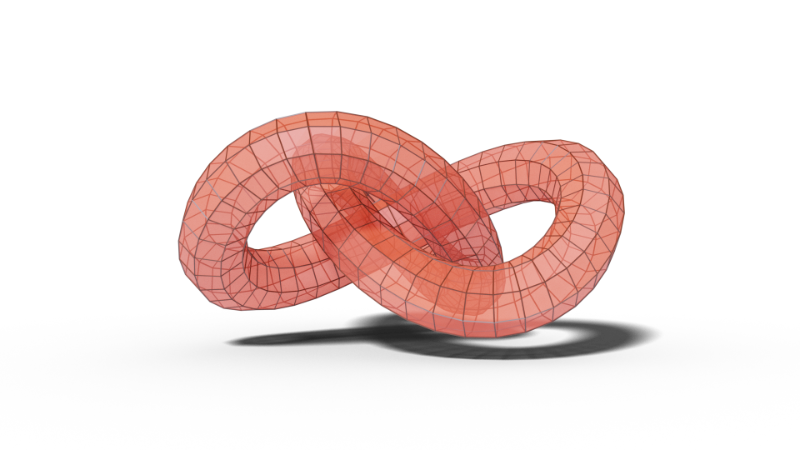
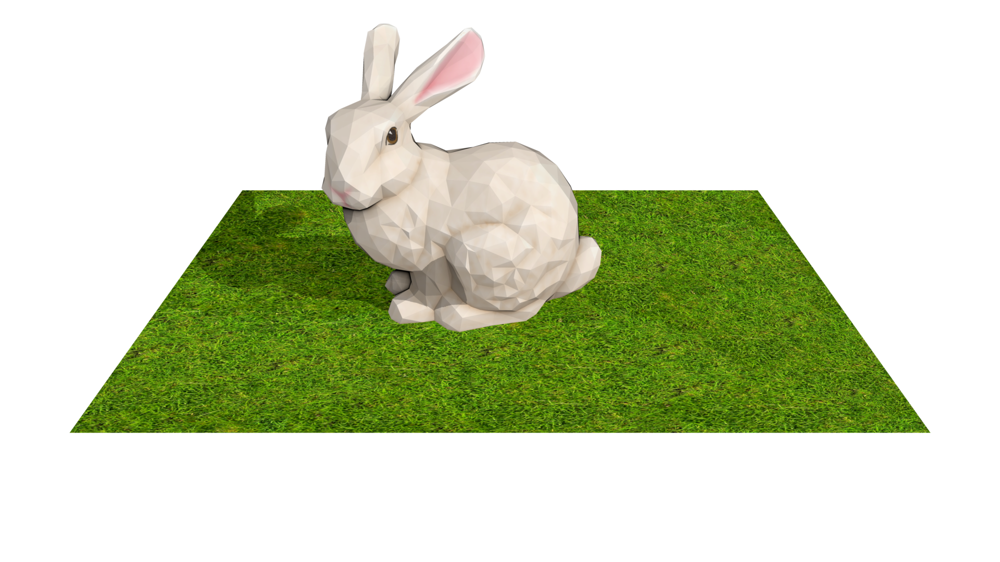

# polyred [](https://pkg.go.dev/poly.red) [](https://github.com/changkun/polyred/releases)   [](https://codecov.io/gh/changkun/polyred) [](https://goreportcard.com/report/github.com/changkun/polyred)

3D graphics facilities in pure Go.

```go
import "poly.red"
```

_Caution: experimenting, expect it to break at any time. Use it at your own risk._

## About

`polyred` is a 3D graphics facility written in pure Go that aims to
implement graphics research algorithms in real-time and offline geometry processing, rendering, animation, and etc.

The geometry related facilities offer different types of geometry
representations, and relevant I/O processors.

The rendering related facility offers two levels of API set where the
low-level API set contains abstract rendering passes for better customization, whereas high-level API set contains pre-defined rendering effects for better usability and performance.

Although `polyred` is a software-only implementation currently, it
remains fast as it is optimized for concurrent execution scheduling
and utilize the full power of CPUs. The project aims to The current
supported key features:

- Cross platform
- No dependency
- Cache-aware concurrency optimization
- Mesh I/O
- Built-in geometries
- Scene graph
- Forward rendering
- Mipmapping
- Sutherland Hodgman Clipping
- Back-face culling
- View frustum culling
- Perspective correct interpolation
- Depth testing
- Deferred shading
- Blinn-Phong reflectance model
- Shadow mapping
- Screen-space ambient occlusion
- Supersampling anti-aliasing
- Shader programming

See a full features list [here](./docs/features.md).

## Getting started

```go
// Create a scene graph
s := scene.NewScene()
s.SetCamera(camera.NewPerspective(
    math.NewVec4(0, 0.6, 0.9, 1), // position
    math.NewVec4(0, 0, 0, 1),     // lookAt
    math.NewVec4(0, 1, 0, 0),     // up
    45,                           // fov
    float64(1920)/float64(1080),  // aspect
    0.1,                          // near
    2,                            // far
))

// Add lights
s.Add(light.NewPoint(
    light.WithPointLightIntensity(7),
    light.WithPointLightColor(color.RGBA{255, 255, 255, 255}),
    light.WithPointLightPosition(math.NewVec4(4, 4, 2, 1)),
    light.WithPointLightShadowMap(true)),
    light.NewAmbient(light.WithAmbientIntensity(0.5)))

// Load models and setup materials
m := io.MustLoadMesh("bunny.obj")
m.SetMaterial(material.NewBlinnPhong(
    material.WithBlinnPhongTexture(
        image.NewTexture(
            image.WithSource(io.MustLoadImage("bunny.png",
                io.WithGammaCorrection(true)),
            ),
            image.WithIsotropicMipMap(true),
        ),
    ),
    material.WithBlinnPhongFactors(0.6, 0.5),
    material.WithBlinnPhongShininess(150),
    material.WithBlinnPhongShadow(true),
    material.WithBlinnPhongAmbientOcclusion(true),
))
m.Scale(2, 2, 2)
s.Add(m)
m = io.MustLoadMesh("ground.obj")
m.SetMaterial(material.NewBlinnPhong(
    material.WithBlinnPhongTexture(
        image.NewTexture(
            image.WithSource(io.MustLoadImage("ground.png",
                io.WithGammaCorrection(true)),
            ),
            image.WithIsotropicMipMap(true),
        ),
    ),
    material.WithBlinnPhongFactors(0.6, 0.5),
    material.WithBlinnPhongShininess(150),
    material.WithBlinnPhongShadow(true),
))
m.Scale(2, 2, 2)
s.Add(m)

// Create the renderer then render the scene graph!
r := render.NewRenderer(
    render.WithSize(1920, 1080),
    render.WithMSAA(2),
    render.WithScene(s),
    render.WithShadowMap(true),
    render.WithGammaCorrection(true),
)
utils.Save(r.Render(), "./render.png")
```

The rendered results:



See more full examples in the [`examples` folder](./examples), and a 
connecting project [polywine](https://changkun.de/s/polywine) to put
polyred results on a window.

## Contributes

Easiest way to contribute is to provide feedback! I would love to hear what you like and what you think is missing. [Issue](https://github.com/changkun/polyred/issues/new) and [PRs](https://github.com/changkun/polyred/pulls) are also welcome.

## License

Copyright &copy; 2020-2021 [Changkun Ou](https://changkun.de). All rights reserved.