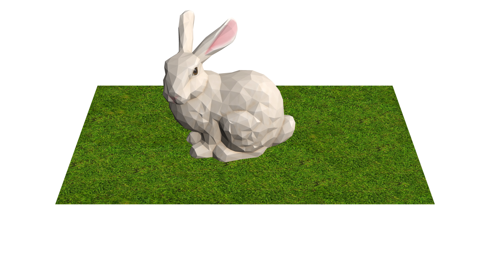
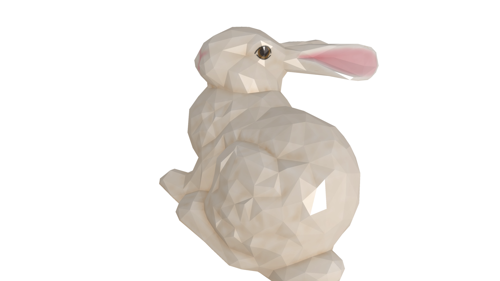
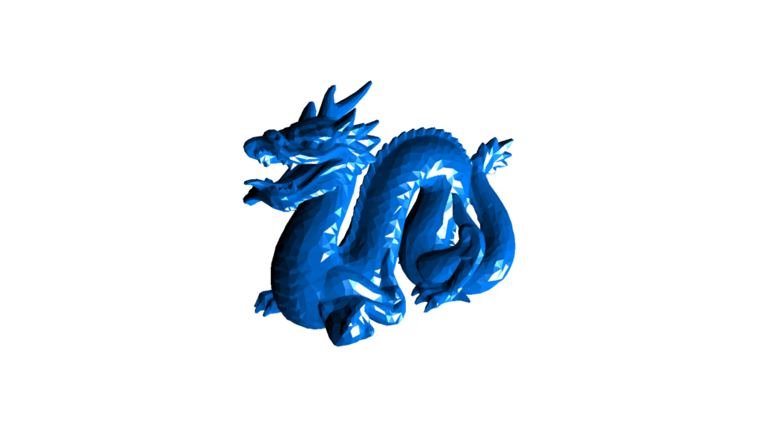

# ddd

A software hybrid renderer written in pure Go.

```go
import "changkun.de/x/ddd"
```

_Caution: experiment, expect it to break at any time. Use it at your own risk._

## Features

- OBJ file format
- rasterization
- backface, viewfrustum, and occlusion culling
- texture and mipmap
- deferred shading
- shadow map
- anti-aliasing

## Getting started

```go
width, height, msaa := 1920, 1080, 2

// Create scene graph
s := rend.NewScene()

// Specify camera settings
c := camera.NewPerspectiveCamera(
    math.NewVector(0, 0.6, 0.9, 1),
    math.NewVector(0, 0, 0, 1),
    math.NewVector(0, 1, 0, 0),
    45,
    float64(width)/float64(height),
    -0.1,
    -3,
)
s.UseCamera(c)

// Add light sources
l := light.NewPointLight(20, color.RGBA{0, 0, 0, 255}, math.NewVector(4, 4, 2, 1))
s.AddLight(l)

// Load assets
m := io.MustLoadMesh("../testdata/bunny.obj")
tex := io.MustLoadTexture("../testdata/bunny.png")
mat := material.NewBlinnPhongMaterial(tex, color.RGBA{0, 125, 255, 255}, 0.5, 0.6, 1, 150)
m.UseMaterial(mat)
s.AddMesh(m)

// Load another assets
m = io.MustLoadMesh("../testdata/ground.obj")
tex = io.MustLoadTexture("../testdata/ground.png")
mat = material.NewBlinnPhongMaterial(tex, color.RGBA{0, 125, 255, 255}, 0.5, 0.6, 1, 150)
m.UseMaterial(mat)
s.AddMesh(m)

// Create the renderer and render it.
r := rend.NewRenderer(
    rend.WithSize(width, height),
    rend.WithMSAA(msaa),
    rend.WithShadowMap(true),
    rend.WithScene(s),
)
utils.Save(r.Render(), "./benchmark.png")
```




## More Examples

| Example | Code |
|:-------:|:-----:|
||[bunny](./examples/bunny/bunny.go)|
||[dragon](./examples/dragon/dragon.go)|

## License

Copyright &copy; 2020-2021 [Changkun Ou](https://changkun.de). All rights reserved.