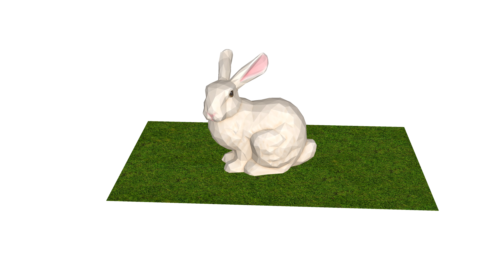
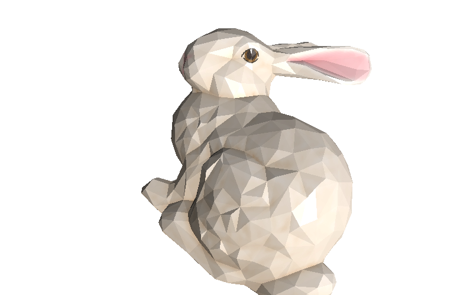
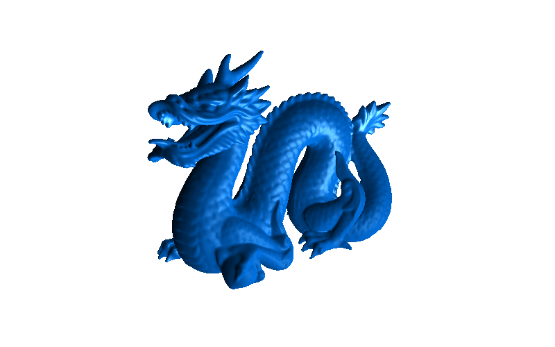

# ddd

Software 3D renderer written in pure Go.

```go
import "changkun.de/x/ddd"
```

## Features

- OBJ file format
- rasterization
- backface, viewfrustum, and occlusion culling
- texture and mipmap
- deferred shading
- anti-aliasing

## Getting started

```go
width, height, msaa := 1920, 1080, 2

// Create scene graph
s := rend.NewScene()

// Specify camera settings
c := camera.NewPerspectiveCamera(
    math.NewVector(-0.5, 0.5, 0.5, 1),
    math.NewVector(0, 0, -0.5, 1),
    math.NewVector(0, 1, 0, 0),
    45,
    float64(width)/float64(height),
    -0.1,
    -3,
)
s.UseCamera(c)

// Add light sources
l := light.NewPointLight(20, color.RGBA{0, 0, 0, 255}, math.NewVector(-200, 250, 600, 1))
s.AddLight(l)

// Load assets
m := geometry.MustLoad("../testdata/bunny.obj")
tex := material.MustLoad("../testdata/bunny.png")
mat := material.NewBlinnPhongMaterial(tex, color.RGBA{0, 125, 255, 255}, 0.5, 0.6, 1, 150)
m.UseMaterial(mat)
m.Rotate(math.NewVector(0, 1, 0, 0), -math.Pi/6)
m.Translate(0, -0, -0.4)
s.AddMesh(m)

// Load another assets
m = geometry.MustLoad("../testdata/ground.obj")
tex = material.MustLoad("../testdata/ground.png")
mat = material.NewBlinnPhongMaterial(tex, color.RGBA{0, 125, 255, 255}, 0.5, 0.6, 1, 150)
m.UseMaterial(mat)
m.Rotate(math.NewVector(0, 1, 0, 0), -math.Pi/6)
m.Translate(0, -0, -0.4)
s.AddMesh(m)

// Create the rasterizer and render it.
r := rend.NewRasterizer(width, height, msaa)
utils.Save(r.Render(s), "./benchmark.png")
```




## More Examples

| Example | Code |
|:-------:|:-----:|
||[bunny](./examples/bunny.go)|
||[dragon](./examples/dragon.go)|

## License

Copyright &copy; 2020-2021 [Changkun Ou](https://changkun.de). All rights reserved.