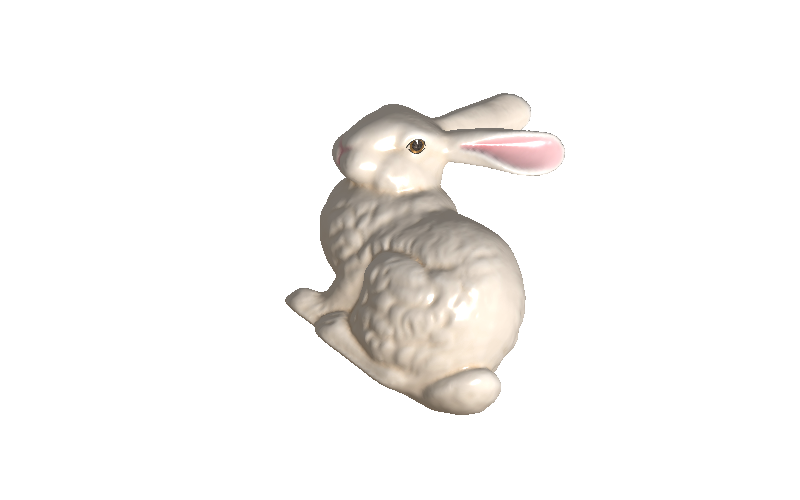

# ddd

ddd is a 3d rasterizer written in pure Go.

## Usage

```go
width, height := 800, 500

// create rasterizer
r := ddd.NewRasterizer(width, height)

// load obj model
m, err := ddd.LoadOBJ("path/to/bunny.obj")
if err != nil {
    panic(fmt.Sprintf("cannot load obj model, err: %v", err))
}

// set model matrix
scale := ddd.NewVector(1500, 1500, 1500, 0)
trans := ddd.NewVector(-700, -5, 350, 1)
m.SetScale(&scale)
m.SetTranslate(&trans)

// set texture
err = m.SetTexture("path/to/texture.jpg", 150)
if err != nil {
    panic(fmt.Sprintf("cannot load model texture, err: %v", err))
}

// set the camera
r.SetCamera(ddd.NewPerspectiveCamera( // perspective
    ddd.NewVector(-550, 194, 734, 1),
    ddd.NewVector(-1000, 0, 0, 1),
    ddd.NewVector(0, 1, 1, 0),
    float64(width)/float64(height),
    100, 600, 45,
))
r.SetCamera(ddd.NewOrthographicCamera( // orthographic
    ddd.NewVector(-550, 194, 734, 1),
    ddd.NewVector(-1000, 0, 0, 1),
    ddd.NewVector(0, 1, 1, 0),
    -float64(width)/2, float64(width)/2,
    float64(height)/2, -float64(height)/2,
    200, -200,
))

// construct scene graph
s := ddd.NewScene()
r.SetScene(s)
s.AddMesh(m)
l := ddd.NewPointLight(
    color.RGBA{255, 255, 255, 255},
    ddd.NewVector(-200, 250, 600, 1), 0.5, 0.6, 1,
)
s.AddLight(l)

// render!
r.Render()

// save result
r.Save("path/to/render.jpg")
```



See complete example [here](./bench/main.go).

## Benchmark

The CPU rasterizer can render the bench example ~100fps:

```go
render perf: 96.52797559309442 fps
render perf: 98.54559512522535 fps
render perf: 100.3256067567289 fps
render perf: 102.2571423546220 fps
render perf: 99.58160787451523 fps
render perf: 98.61453481600944 fps
render perf: 101.7631275961046 fps
render perf: 102.1985880038684 fps
render perf: 94.79118639132228 fps
render perf: 95.41987464309389 fps
```

See more about pprof.

## License

GNU GPLv3 &copy; [Changkun Ou](https://changkun.de)