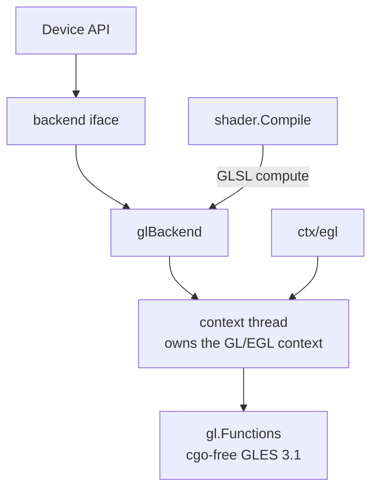

# cgo-free OpenGL ES backend for the GPU abstraction

## Overview

The GPU abstraction has one driver today (Metal, darwin). This spec adds a
second: a cgo-free OpenGL ES 3.1 backend that implements the same private
`backend` interface, giving the abstraction a cross-platform path (Linux, and
Windows via ANGLE) for the compute pipeline first, render pipeline second. It is
the keystone the design doc calls out as never laid (`docs/gpu-abstraction.md`
sections 2 and 3).

## Current State

- `gpu/backend.go` defines the private `backend` interface (and
  `backendBuffer`/`backendTexture`/`backendComputePipeline`/`backendCommandBuffer`
  etc.) that the public `Device` API dispatches to. The Metal backend
  (`gpu/backend_darwin.go`, `gpu/mtl`) is the only implementation;
  `gpu/backend_other.go` is a non-darwin stub that returns "no GPU".
- `gpu/gl` already provides cgo-free GLES 2/3 entry points as methods on
  `*gl.Functions` (`syscall`/`purego`-based: `gl_windows.go` via `libGLESv2.dll`,
  `gl_unix.go` via cgo today but the binding shape is GLES). `gpu/ctx/egl`
  provides an EGL context on Linux (X11) and Windows (ANGLE).
- `gpu/shader` compiles Go kernels to MSL only. A GLSL (GLES compute) emitter
  does not exist yet; it is a prerequisite for this backend.
- The design decision is settled (`docs/gpu-abstraction.md` section 3): the
  abstraction mirrors the explicit command-buffer model (Metal/Vulkan/DX12). GL
  is stateful/implicit, so the GL backend **emulates** the model: it records
  encoded commands and replays them on a dedicated context thread.

## Architecture

The GL context is current on exactly one OS thread. `glBackend` owns a
`runtime.LockOSThread`-pinned goroutine ("context thread"); every `backend`
method marshals its work onto that thread and waits for the result. This matches
the design doc's "small internal context-thread runtime" (section 3).

## Components

### `gpu/shader`: GLSL compute emitter (prerequisite)

Add a GLSL ES 3.10 compute emitter alongside the MSL one. Same front end
(parser + the reference-validation pass); a second backend visitor that emits:
- `#version 310 es`, `layout(local_size_x=1) in;`
- storage buffers as `layout(std430, binding=N) buffer { float data[]; }`
- uniforms as a `std140` uniform block
- `gl_GlobalInvocationID.x` for the thread id
- vec/mat types map to GLSL `vec4`/`mat4`; swizzles and builtins already align
  with GLSL spelling (sqrt/pow/clamp/dot/normalize/mix/...).
`Kernel` gains a `GLSL string` field (or `Source(lang)` accessor); `Bindings`
already carry index + kind and are reused as-is.

### `gpu/backend_gl.go` (new, build-tagged `linux || windows`)

Implements `backend`:
- `newBuffer`: `glGenBuffers` + `glBufferData` into a `GL_SHADER_STORAGE_BUFFER`;
  `bytes()` reads back via `glMapBufferRange`/`glGetBufferSubData`.
- `newShaderModule` / `newComputePipeline`: `glCreateShader(GL_COMPUTE_SHADER)`,
  compile, link into a program; `maxThreads()` from
  `GL_MAX_COMPUTE_WORK_GROUP_INVOCATIONS`.
- `newCommandBuffer`: returns a recorder. `beginCompute`/`setComputePipeline`/
  `setBuffer`/`dispatch`/`endCompute` append ops; `commit` replays them on the
  context thread (`glUseProgram`, `glBindBufferBase`, `glDispatchCompute`,
  `glMemoryBarrier`).
- Textures/samplers/render pipeline: stub first (return unsupported), then add
  for the render path in a follow-up once compute is verified.
- `waitIdle`: `glFinish` on the context thread.

### `gpu/backend_other.go` + `openBackend`

Replace the unconditional stub on `linux`/`windows` with the GL backend; keep
the stub for platforms with neither Metal nor GL. `openBackend` (per-platform)
selects Metal on darwin, GL elsewhere.

## Data Flow

`Device.Open` -> `openBackend` -> `glBackend{}` spins up the context thread and
creates a headless EGL context (pbuffer/surfaceless). A compute dispatch:
record ops -> `commit` -> context thread binds program + SSBOs, dispatches,
memory-barriers, finishes -> `buffer.bytes()` reads back. Mirrors the existing
matrix `add/sub/sqrt/mul` compute demo, which becomes the cross-backend
conformance test.

## Testing Strategy

**Runtime is CI-verifiable in software, no GPU hardware needed (proven).** The
`gl-probe` workflow demonstrated that the stock GitHub `ubuntu-latest` runner,
with Mesa installed (`libegl1 libgles2 libgl1-mesa-dri`) and
`EGL_PLATFORM=surfaceless`, provides a headless **OpenGL ES 3.2** context
(llvmpipe, GLSL ES 3.20) with `GL_MAX_COMPUTE_WORK_GROUP_INVOCATIONS = 1024`,
reached cgo-free through purego (`gpu/eglprobe_linux_test.go`). So compute
shaders run in software on the runner; the GL backend is verified the same way
the Metal backend is on macOS.

- **Conformance (CI, software):** reuse the Metal compute tests as
  backend-agnostic conformance tests: run the matrix `add/sub/sqrt/mul` and a
  Blinn-Phong kernel through the GL backend and assert parity with the CPU
  reference (not necessarily bit-identical with Metal). Run them in a CI job that
  installs Mesa and sets `EGL_PLATFORM=surfaceless`; `Open()` skips when no GL
  device is present so the tests are a no-op on a dev box without Mesa.
- **Build gate:** `GOOS=linux CGO_ENABLED=0 go build ./gpu/...` (the backend is
  cgo-free, purego-loaded), same loop that verified the Windows present port.
- **macOS note:** Apple's OpenGL caps at 4.1 (no compute), so this backend is not
  exercised on darwin; the Linux software runner is the verification path. macOS
  keeps using Metal.

## Sequencing

1. **Done.** GLSL compute emitter in `gpu/shader` (`CompileGLSL`, pure Go,
   unit-tested offline in `gpu/shader/glsl_test.go`): emits GLES 3.10 compute
   with std430 SSBO + std140 UBO layouts, `gl_GlobalInvocationID` thread id,
   vec/mat spellings, and reserved-word (`out`) mangling. The MSL path is
   unchanged (byte-identical: the target only affects emission).
2. **Done.** `glBackend` (`gpu/backend_gl.go`): cgo-free EGL/GLES via purego, a
   surfaceless context on a locked context thread, and the storage-buffer compute
   path (SSBO create/upload/readback, compile+link, bind, dispatch, barrier).
   `openBackend` selects GL on Linux.
3. **Done.** Conformance run, green in CI on Mesa llvmpipe (software, surfaceless):
   `TestGLBackendCompute` runs Go Add/Sub/Sqrt kernels through `CompileGLSL` and
   the public Device API and matches the CPU (`.github/workflows/gl-probe.yml`).
4. **Done.** Uniform-buffer (UBO) bindings: buffers carry their GL target from
   `BufferUsage`, so std140 struct uniforms bind as `GL_UNIFORM_BUFFER` alongside
   SSBOs. `TestGLBackendUniform` (a struct-uniform Scale kernel) is green in CI.
   The compute backend now covers every binding the engine's compute kernels use
   (storage + uniform; no textures).
5. **Done.** Render-to-texture path: render-target textures backed by an FBO,
   vertex+fragment program linking, render pass (bind/viewport/clear), vertex
   buffers as SSBOs indexed by `gl_VertexID` (the Metal vertex model), draw, and
   Y-flipped pixel readback. `TestGLBackendRender` draws a triangle into a texture
   through the Device API and checks the readback, green in CI. This is the
   headless render path windowed present (gpu-windowed-present.md) builds on.
6. **Verified.** The renderer's actual deferred Blinn-Phong compute kernel runs
   on GL: `TestGLBackendDeferredKernel` compiles it with `CompileGLSL`, marshals
   its `Scene` uniform in std140, runs it through the Device API, and matches the
   hand-computed value. (Running a real driver hardened the emitter: GLSL needs
   `vec4(0.0)` / `0.0` zero-inits, not MSL's scalar `0`.) Remaining integration:
   select GL in the renderer on Linux, and a Go to GLSL vertex/fragment emitter so
   render shaders are authored in Go too (today the render path accepts
   hand-written GLSL via the escape hatch).
7. Vulkan (MoltenVK/SDK) and DX12 reuse the same `backend` interface and the
   SPIR-V/HLSL emitters; out of scope here, tracked separately.
