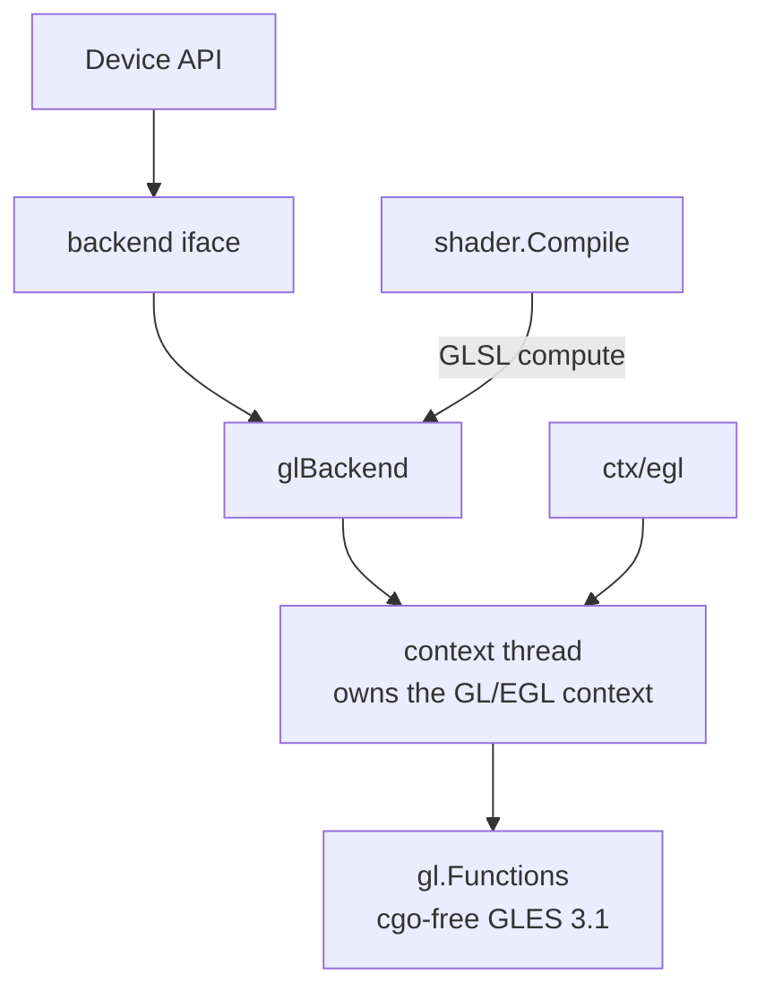

# cgo-free OpenGL ES backend for the GPU abstraction

## Overview

The GPU abstraction has one driver today (Metal, darwin). This spec adds a
second: a cgo-free OpenGL ES 3.1 backend that implements the same private
`backend` interface, giving the abstraction a cross-platform path (Linux, and
Windows via ANGLE) for the compute pipeline first, render pipeline second. It is
the keystone the design doc calls out as never laid (`docs/gpu-abstraction.md`
sections 2 and 3).

## Current State

- `gpu/backend.go` defines the private `backend` interface (and
  `backendBuffer`/`backendTexture`/`backendComputePipeline`/`backendCommandBuffer`
  etc.) that the public `Device` API dispatches to. The Metal backend
  (`gpu/backend_darwin.go`, `gpu/mtl`) is the only implementation;
  `gpu/backend_other.go` is a non-darwin stub that returns "no GPU".
- `gpu/gl` already provides cgo-free GLES 2/3 entry points as methods on
  `*gl.Functions` (`syscall`/`purego`-based: `gl_windows.go` via `libGLESv2.dll`,
  `gl_unix.go` via cgo today but the binding shape is GLES). `gpu/ctx/egl`
  provides an EGL context on Linux (X11) and Windows (ANGLE).
- `gpu/shader` compiles Go kernels to MSL only. A GLSL (GLES compute) emitter
  does not exist yet; it is a prerequisite for this backend.
- The design decision is settled (`docs/gpu-abstraction.md` section 3): the
  abstraction mirrors the explicit command-buffer model (Metal/Vulkan/DX12). GL
  is stateful/implicit, so the GL backend **emulates** the model: it records
  encoded commands and replays them on a dedicated context thread.

## Architecture

The GL context is current on exactly one OS thread. `glBackend` owns a
`runtime.LockOSThread`-pinned goroutine ("context thread"); every `backend`
method marshals its work onto that thread and waits for the result. This matches
the design doc's "small internal context-thread runtime" (section 3).

## Components

### `gpu/shader`: GLSL compute emitter (prerequisite)

Add a GLSL ES 3.10 compute emitter alongside the MSL one. Same front end
(parser + the reference-validation pass); a second backend visitor that emits:
- `#version 310 es`, `layout(local_size_x=1) in;`
- storage buffers as `layout(std430, binding=N) buffer { float data[]; }`
- uniforms as a `std140` uniform block
- `gl_GlobalInvocationID.x` for the thread id
- vec/mat types map to GLSL `vec4`/`mat4`; swizzles and builtins already align
  with GLSL spelling (sqrt/pow/clamp/dot/normalize/mix/...).
`Kernel` gains a `GLSL string` field (or `Source(lang)` accessor); `Bindings`
already carry index + kind and are reused as-is.

### `gpu/backend_gl.go` (new, build-tagged `linux || windows`)

Implements `backend`:
- `newBuffer`: `glGenBuffers` + `glBufferData` into a `GL_SHADER_STORAGE_BUFFER`;
  `bytes()` reads back via `glMapBufferRange`/`glGetBufferSubData`.
- `newShaderModule` / `newComputePipeline`: `glCreateShader(GL_COMPUTE_SHADER)`,
  compile, link into a program; `maxThreads()` from
  `GL_MAX_COMPUTE_WORK_GROUP_INVOCATIONS`.
- `newCommandBuffer`: returns a recorder. `beginCompute`/`setComputePipeline`/
  `setBuffer`/`dispatch`/`endCompute` append ops; `commit` replays them on the
  context thread (`glUseProgram`, `glBindBufferBase`, `glDispatchCompute`,
  `glMemoryBarrier`).
- Textures/samplers/render pipeline: stub first (return unsupported), then add
  for the render path in a follow-up once compute is verified.
- `waitIdle`: `glFinish` on the context thread.

### `gpu/backend_other.go` + `openBackend`

Replace the unconditional stub on `linux`/`windows` with the GL backend; keep
the stub for platforms with neither Metal nor GL. `openBackend` (per-platform)
selects Metal on darwin, GL elsewhere.

## Data Flow

`Device.Open` -> `openBackend` -> `glBackend{}` spins up the context thread and
creates a headless EGL context (pbuffer/surfaceless). A compute dispatch:
record ops -> `commit` -> context thread binds program + SSBOs, dispatches,
memory-barriers, finishes -> `buffer.bytes()` reads back. Mirrors the existing
matrix `add/sub/sqrt/mul` compute demo, which becomes the cross-backend
conformance test.

## Testing Strategy

- **Build gate (CI, available now):** `GOOS=linux go build` of `./gpu/...` must
  pass; the Windows path already cross-builds. This is the same loop that
  verified the Windows present port.
- **Runtime conformance (needs a Linux box + EGL/GLES 3.1):** reuse the Metal
  compute tests as backend-agnostic conformance tests: run the matrix
  `add/sub/sqrt/mul` and a Blinn-Phong kernel through the GL backend and assert
  parity with the CPU reference (not necessarily bit-identical with Metal). Gate
  these behind a build tag / `Open()` skip when no GL device is present, exactly
  as the darwin GPU tests skip when no Metal device is present.
- **Honest gate:** macOS caps OpenGL at 4.1 (no compute shaders), so this backend
  cannot be runtime-verified on darwin; CI build + a Linux runner are the
  verification path. Do not mark "working" until a Linux run is green; "builds"
  and "runtime-verified" are tracked as separate states (see `specs/README.md`).

## Sequencing

1. GLSL compute emitter in `gpu/shader` (pure Go, unit-testable offline).
2. `glBackend` compute path + context-thread runtime (build-verifiable now).
3. Linux runtime conformance run (gated on hardware).
4. Render pipeline (textures, render pass) as a follow-up.
5. Vulkan (MoltenVK/SDK) and DX12 reuse the same `backend` interface and the
   SPIR-V/HLSL emitters; out of scope here, tracked separately.
