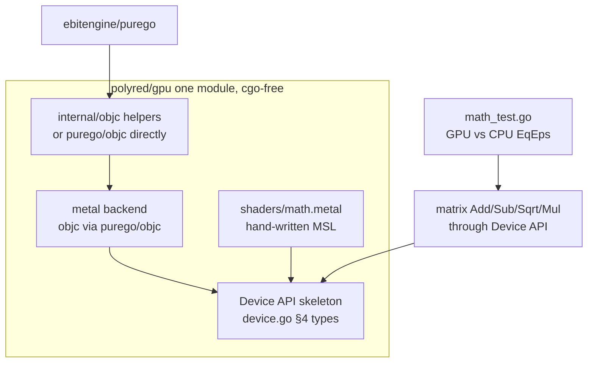

# GPU Abstraction Phase 1 — Foundation

## Overview

Lay the foundation for the GPU abstraction described in
[`docs/gpu-abstraction.md`](../../docs/gpu-abstraction.md): fold the sibling
`poly.red/x/gpu` module into the `polyred` repo under `gpu/`, replace the cgo
Metal backend with a **cgo-free** implementation using `ebitengine/purego`, stand
up the core `Device` API skeleton (§4 of the design), and prove the whole stack
by reimplementing the existing matrix `Add/Sub/Sqrt/Mul` compute demo through the
`Device` API on Metal with `CGO_ENABLED=0`. The matrix kernels use the existing
hand-written MSL (`tests/shaders/math.metal`) as an escape hatch; the Go→shader
compiler is a later phase.

This is the keystone the project never laid: a real `Device` API that the
matrix demo (and later the renderer) programs against, instead of talking to
each backend directly.

## Current State

- `poly.red/x/gpu` is a separate local repo at `../gpu` (remote
  `github.com/polyred/gpu.git`, never pushed). 4 commits, May 2022. Module path
  `poly.red/x/gpu`, `require poly.red v0.0.0`, wired via the parent `go.work`.
- Real code: **Metal** `mtl/mtl_darwin.go` (~590 lines, cgo via `mtl.m`/`mtl.h`,
  ~30 objc-wrapping C functions), **GL/GLES** `gl/` (~2400 lines, cgo), context
  creation `ctx/` (EGL/X11/CGL), and `tests/` (the matrix demo, talking to
  backends directly).
- `device.go` is an **empty** package doc; `vk/`, `dx12/` are **empty stubs**.
- `internal/dl/` is a broken cgo-free loader (truncated
  `sys_darwin_arm64.s:71`) — the only thing that breaks `go build ./...` today.
- polyred's in-repo `gpu/` is a copy of the same toy (`gpu/mtl`, `gpu/gl`,
  `gpu/ctx`, `gpu/tests`, `gpu/syscall`).
- The Metal cgo surface to replace (from `mtl/mtl.h`): `CreateSystemDefaultDevice`,
  `Device_MakeCommandQueue`, `CommandQueue_MakeCommandBuffer`,
  `CommandBuffer_MakeComputeCommandEncoder`, `ComputeCommandEncoder_*`
  (`SetComputePipelineState`/`SetBytes`/`SetBuffer`/`DispatchThreads`),
  `CommandEncoder_EndEncoding`, `CommandBuffer_Commit/WaitUntilCompleted`,
  `Device_MakeBuffer`, `Buffer_Content`, `Device_MakeLibrary`,
  `Library_MakeFunction`, `Device_MakeComputePipelineState`, plus the
  texture/blit/drawable functions (needed later, not by the compute slice).
- The matrix compute flow (`../gpu/tests/math_darwin.go`): make 3 buffers →
  command queue → command buffer → compute encoder → set pipeline + buffers →
  dispatch → commit → wait → read back `Buffer.Content()`. Verified against CPU
  with `math.Mat.EqEps` (see `gpu/tests/math_test.go`, `gpuEps=1e-5`).

## Architecture

The `Device` API (top-level package `gpu`) is backend-agnostic. The Metal
backend implements it using Objective-C runtime calls (`objc_msgSend`,
`objc_getClass`, `sel_registerName`) loaded via `ebitengine/purego` — no
`import "C"`. The matrix demo and its test consume only the `Device` API.

## Components

### C1. Fold `poly.red/x/gpu` into `polyred/gpu`

- Replace polyred's toy `gpu/` with the real backends from `../gpu`: move
  `mtl/` (to be rewritten, C2), `gl/`, `ctx/`, `syscall/`, keeping import paths
  rebased from `poly.red/x/gpu/...` to `poly.red/gpu/...`.
- Delete empty `device.go`/`vk/`/`dx12/` stubs and the broken `internal/dl/`.
- Update `go.work`: remove the `./gpu` member (the sibling module folds in); the
  workspace then references only `./polyred`. Retire the `github.com/polyred/gpu`
  remote (archive; never published).
- Exit check: `go build ./...` resolves all `poly.red/gpu/...` imports.

### C2. cgo-free Metal backend via purego

- Add `github.com/ebitengine/purego` to `go.mod` (currently zero deps).
- Rewrite `gpu/mtl/mtl_darwin.go` to call the Objective-C runtime via
  `purego/objc` instead of the `mtl.m`/`mtl.h` cgo bridge; **delete** `mtl.m`,
  `mtl.h`. Each former C function becomes class/selector lookups + `objc.Send`:
  - `CreateSystemDefaultDevice` → `MTLCreateSystemDefaultDevice()` (a C function
    in `Metal.framework`, loaded via `purego.Dlopen` of the framework +
    `purego.RegisterLibFunc`).
  - object methods (`makeCommandQueue`, `commandBuffer`,
    `computeCommandEncoder`, `setComputePipelineState:`, `setBuffer:offset:atIndex:`,
    `dispatchThreads:threadsPerThreadgroup:`, `endEncoding`, `commit`,
    `waitUntilCompleted`, `newBufferWithBytes:length:options:`, `contents`,
    `newLibraryWithSource:options:error:`, `newFunctionWithName:`,
    `newComputePipelineStateWithFunction:error:`) → `objc.ID.Send(sel, args...)`.
  - structs passed by value (`MTLSize`) must match the Metal ABI; use the
    arm64/amd64 `objc_msgSend` variants purego provides.
- Keep the existing Go-facing `mtl` types/signatures (`Device`, `Buffer`,
  `CommandQueue`, `ComputeCommandEncoder`, `ComputePipelineState`, `Library`,
  `Function`, `Size`, `ResourceOptions`) so the rest of the code is unaffected;
  only their bodies change from cgo to purego.
- Risk surface: `objc_msgSend` calling convention per arch and struct-return /
  float variants. Mitigate by testing each selector incrementally against the
  matrix demo. arm64 is the primary target (dev machine); amd64 follows.

### C3. `Device` API skeleton (compute subset)

- New `gpu/device.go` (real, not a doc stub) implementing the §4 types needed
  for compute: `Device`, `Queue`, `Buffer`/`BufferDescriptor`/`BufferUsage`,
  `ShaderModule`/`ShaderSource`, `BindGroupLayout`/`BindGroupLayoutEntry`,
  `BindGroup`/`BindGroupEntry`, `PipelineLayout`, `ComputePipeline`/
  `ComputePipelineDescriptor`, `CommandEncoder`, `ComputePass`. Render-path types
  (`RenderPipeline`/`RenderPass`/`Texture`/`Sampler`) are declared but may be
  stubbed/`TODO` this phase.
- `gpu.Open(opts...)` selects the Metal backend on darwin (only backend wired
  this phase; others return "unsupported" for now).
- Backend dispatch: a private interface (e.g. `backend`) that the metal backend
  satisfies, so GL/Vulkan/DX12 slot in later without changing the public API.
- Bindings map to Metal buffer index ranges per `docs/gpu-abstraction.md` §4.

### C4. Matrix demo through the Device API

- Reimplement `Add/Sub/Sqrt/Mul` (currently `gpu/tests/math_darwin.go`) once,
  against the `Device` API (per the §5a slice), loading `shaders/math.metal` via
  `Device.NewShaderModule`. Delete the per-backend duplication for the Metal
  path.
- Keep `gpu/tests/math_test.go` semantics (GPU vs CPU `EqEps`, `gpuEps=1e-5`,
  skip when no device).

## Data Flow

Matrix `Add(m1, m2)` through the abstraction:
1. `gpu.Open()` → Metal `Device` (objc `MTLCreateSystemDefaultDevice`).
2. `NewShaderModule(math.metal)` → `MTLLibrary`; `NewComputePipeline{Entry:"add"}`
   → `MTLComputePipelineState`.
3. `NewBuffer` ×3 (a, b, out) → `MTLBuffer` (shared storage).
4. `NewBindGroup` binds a/b/out to indices 0/1/2.
5. `CommandEncoder.BeginComputePass` → set pipeline + bind group → `Dispatch` →
   `End` → `Queue.Submit(Finish())` → `Queue.WaitIdle()`.
6. Read `out.Map()` → `[]float32` → `math.Mat[float32]`.

## API Surface

- New public package `poly.red/gpu` with the `Device` API (§4). No CLI/env
  changes. Build constraint: Metal backend files are `//go:build darwin`.
- New dependency: `github.com/ebitengine/purego`.

## Error Handling

- `gpu.Open` returns an error when no device/driver is available (tests skip, as
  today via `Driver().Available()`).
- objc lookups (class/selector/framework symbol) are resolved once at init;
  failure is a hard error with the missing name.
- Shader compile / pipeline creation surface the Metal `NSError` description as a
  Go error (the cgo bridge already returned these; preserve it via objc).

## Testing Strategy

- **Build gate:** `CGO_ENABLED=0 go build ./...` must succeed on darwin/arm64 —
  the proof of cgo-free. Add to CI (`.github/workflows/polyred.yml`) for macOS.
- **Unit/integration:** `gpu/tests/math_test.go` — `TestAdd/Sub/Sqrt/Mul` compare
  GPU (through the Device API) vs CPU with `EqEps(.., 1e-5)`; skip when no
  device. These already exist; they must pass unchanged against the new path.
- **Regression:** the deterministic `math.TestMat_EqEps` (no GPU) stays green.
- **Benchmarks:** keep `BenchmarkAdd/Mul` to confirm no major regression vs the
  raw-cgo path.
- **Edge cases:** dimension-mismatch panics preserved; empty matrices; readback
  correctness for non-power-of-two sizes; device-absent path (headless CI).

## Validation (spike, 2026-06-20)

The cgo-free Metal approach is **proven**. A throwaway purego spike built with
`CGO_ENABLED=0` and at runtime: created a Metal device via
`MTLCreateSystemDefaultDevice` (loaded with `purego.Dlopen` of
`/System/Library/Frameworks/Metal.framework/Metal` + `RegisterLibFunc`),
messaged an object-returning selector (`name` → NSString → `UTF8String` →
"Apple M2"), and a scalar-returning selector (`recommendedMaxWorkingSetSize` →
uint64) via `objc.ID.Send` / `objc.Send[T]`. So the C2 rewrite is de-risked: it
is mechanical selector-by-selector translation, not a research problem.

## Notes / Decisions deferred to later phases

- Go→shader compiler (Phase 2): this phase uses hand-written MSL.
- cgo-free **GL** backend + context-thread emulation (Phase 2): only Metal is
  wired here.
- Render pipeline / renderer integration (Phase 3).
- This spec is **xlarge** and may be broken into tasks: (T1) fold-in + build
  green, (T2) purego Metal backend, (T3) Device API skeleton, (T4) matrix demo +
  tests. T1→T2→T3→T4 is the natural order; T2 is the highest-risk.

## Progress

- **T2 (cgo-free Metal backend) — DONE** (commit `5c37519`). `gpu/mtl` rewritten
  onto `purego/objc`, `mtl.m`/`mtl.h` deleted; `CGO_ENABLED=0 go test ./gpu/mtl/`
  and the `gpu/tests` matrix Add/Sub/Sqrt/Mul pass cgo-free. The exported `mtl`
  API is unchanged, so `app`/`gpu/ctx/ca` (still cgo) keep compiling.
- **T1 (fold-in) — adjusted:** per review, work in place on the in-repo `gpu/`
  rather than a destructive move; retiring the unpublished `../gpu` repo is a
  trivial cleanup deferred until the slice is fully proven. Loose end: the
  `!darwin` GL demo (`gpu/tests/math_gl.go`) still imports pre-restructure paths
  (`poly.red/internal/driver/egl|gles`) — pre-existing, fixed in Phase 2 (GL).
- **T3 (Device API skeleton) — DONE** (commit `1e2b457`). `gpu/device.go` +
  `gpu/backend.go` + `gpu/backend_darwin.go`: the WebGPU-style compute API
  (Device/Queue/Buffer/BindGroupLayout/BindGroup/PipelineLayout/ComputePipeline/
  CommandEncoder/ComputePass) behind a private `backend` interface, with the
  Metal backend over `gpu/mtl`. Render-path types deferred to Phase 3.
- **T4 (matrix demo through the Device API) — DONE** (commit `1e2b457`).
  `gpu/compute_darwin_test.go` runs Add/Sub/Sqrt/Mul through the `Device` API and
  matches the CPU `math.Mat` results (`EqEps`, 1e-5), cgo-free. The §5a compute
  slice is proven end-to-end.

**Status: Phase 1 compute slice COMPLETE.** Remaining Phase 1 cleanup: retire the
unpublished `../gpu` repo (T1), fix the pre-existing stale GL imports in
`gpu/tests/math_gl.go`. Then Phase 2 (cgo-free GL backend + Go→shader compiler).
