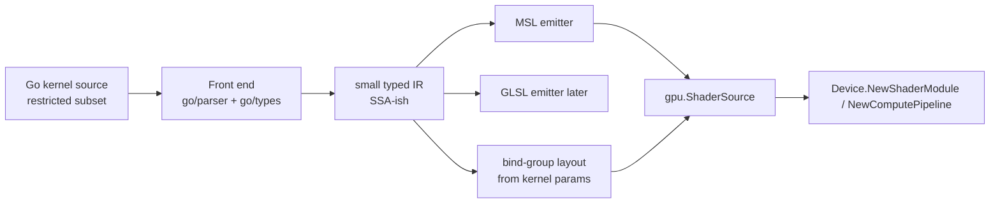

# GPU Abstraction Phase 2 — Go→shader compute compiler

## Overview

Author GPU compute kernels in Go and compile them to backend shading languages,
starting with MSL (Metal). This replaces the hand-written `math.metal` escape
hatch used in Phase 1 with a real Go→shader path, fulfilling the locked decision
"Go→shader now" (docs/gpu-abstraction.md §6b). The proof is re-deriving the four
matrix kernels (`add0`/`sub0`/`sqrt0`/`mul0`) from Go source and running them
through the existing `Device` API with identical results.

## Current State

- Phase 1 landed the `Device` API (`gpu/device.go`) and a cgo-free Metal backend
  (`gpu/mtl`, `gpu/backend_darwin.go`). Compute pipelines are created from
  `ShaderSource{MSL: ...}`; `gpu/compute_darwin_test.go` proves the slice.
- The kernels exist only as hand-written MSL in `gpu/tests/shaders/math.metal`
  (`add0`/`sub0`/`sqrt0`/`mul0`, the last using a `Params{widthA,heightA,widthB}`
  constant buffer). These are the compiler's first target outputs.
- `poly.red/math` already defines the vector/matrix types kernels will use.
- No Go→shader machinery exists yet.

## Architecture



New package `gpu/shader` (the compiler). It parses a restricted Go subset,
type-checks with `go/types`, lowers to a small IR, and emits MSL (this phase) +
the matching `BindGroupLayout`. The output feeds the existing `Device` API
unchanged.

## Components

### C1. Kernel authoring model

- A kernel is a Go function with a recognized signature: a thread-id parameter
  (`gid uint` / a `gpu.Thread` value) plus typed buffer/uniform parameters whose
  order maps to binding indices. Example target:
  ```go
  func Add(gid uint, a, b []float32, out []float32) { out[gid] = a[gid] + b[gid] }
  ```
- Allowed subset: arithmetic, `for`, `if`, indexing, fixed-size arrays,
  `poly.red/math` vector/matrix types, a whitelisted builtin set
  (dot/cross/normalize/sqrt/...). Disallowed: goroutines, channels, interfaces,
  maps, recursion, heap allocation, closures.

### C2. Front end (`gpu/shader/parse.go`)

- Parse the kernel source with `go/parser`; type-check with `go/types` so type
  errors surface as Go diagnostics with real positions before any GPU call.
- Identify kernel functions by signature; resolve parameter kinds (storage
  buffer vs uniform) from type and tags.

### C3. IR + lowering (`gpu/shader/ir.go`)

- Lower the typed AST to a small SSA-ish IR (consider
  `golang.org/x/tools/go/ssa`). The IR is backend-neutral and keeps emitters
  small.

### C4. MSL emitter (`gpu/shader/msl.go`)

- Emit MSL from the IR: map `[]float32` params to `device float*`, uniforms to
  `constant T&`, the thread id to `[[thread_position_in_grid]]`. Produce a
  kernel whose results are bit-identical (within float tolerance) to the
  hand-written `math.metal`.

### C5. Layout synthesis (`gpu/shader/layout.go`)

- Emit the `gpu.BindGroupLayout` entries (binding index, kind, visibility) from
  the kernel parameter list, so shader text and layout cannot drift.

### C6. Public entry (`gpu/shader/compile.go`)

- `Compile(src string) (*Module, error)` returning the per-language
  `gpu.ShaderSource` plus the synthesized layout, ready for
  `Device.NewShaderModule` / `NewComputePipeline`.

## Testing Strategy

- **Golden output:** compile the four Go kernels; assert the emitted MSL compiles
  via `Device.NewShaderModule` (real Metal compile) — not just string matching.
- **End-to-end parity:** rerun the Phase 1 matrix tests
  (`gpu/compute_darwin_test.go` style) but sourcing kernels from the compiler
  instead of `math.metal`; results must match CPU `math.Mat` within `1e-5`.
- **Negative tests:** disallowed constructs (goroutine, map, recursion) produce a
  compile error with a Go position.
- **Determinism:** same input → identical MSL output.

## Progress

**Compute→MSL compiler — DONE** (commit `2f6c1c0`). `gpu/shader`:
- C1 authoring model, C2 front end (`go/parser`), C4 MSL emitter, C5 layout
  synthesis, C6 public `Compile` — implemented.
- The four matrix kernels are authored in Go (`Add`/`Sub`/`Sqrt`/`Mul`),
  compiled to MSL, and run through the `Device` API on Metal matching the CPU
  `math.Mat` results within `1e-5`, cgo-free (`gpu/shader/run_darwin_test.go`).
  Unit + negative tests in `gpu/shader/compile_test.go`.
- Read-only vs read-write buffers are detected (const vs device); struct uniforms
  and the `Params` constant buffer work; goroutines/unsupported calls are
  rejected.

**Honest simplifications (hardening follow-ups):**
- C3: used a direct typed-AST walker, not a full SSA IR. Fine for the current
  subset; revisit if control flow grows.
- C2: validation is via `go/parser` + a lightweight signature/type environment,
  not full `go/types` checking. Adding `go/types` would catch more misuse with
  precise positions — tracked, not yet done.

## Notes

- GLSL/SPIR-V/HLSL emitters and the vertex/fragment profile are later milestones
  (Phase 3+). This phase is compute→MSL only, to keep the first Go→shader slice
  testable on darwin. GLSL needs the cgo-free GL backend (and Linux to verify).
- Reuse over reinvention: study tinygo's lowering and existing Go-shader
  experiments before fixing the IR (docs/gpu-abstraction.md §6b).
