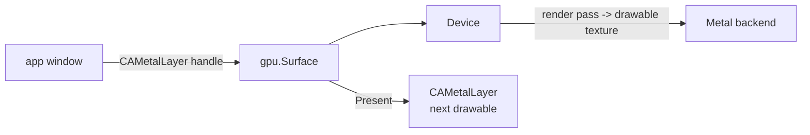

# Windowed present (Surface / swapchain) for the GPU abstraction

## Status

The backend-agnostic **Surface/swapchain API is implemented and CI-verified
headless** (`gpu/surface.go`): `Device.CreateSurface`, `AcquireNextTexture`,
`Present`, `Texture`, `Resize`. `TestSurfaceHeadlessPresent` renders frames
through the swapchain on the GL backend (Mesa llvmpipe) and reads them back, with
double-buffering and resize checks. What remains is the **on-screen** attachment
(handing a swapchain texture to a window: a `CAMetalLayer` drawable on darwin, an
EGL/WGL window surface elsewhere), which needs a display and is not verifiable in
headless CI. The sections below describe that remaining on-screen layer.

## Overview

Today the GPU abstraction renders only headless: it draws into a texture and
reads pixels back (the `gpudemo` PNG path). This spec adds a `Surface`
(swapchain) API so a render pipeline's output can be presented to a window. The
first backend is Metal over a `CAMetalLayer`; the app layer (`app/`) drives the
window and acquires drawables.

## Current State

- `gpu/device.go` / `gpu/render.go` expose the `Device`/render-pipeline API; the
  Metal backend renders into a `backendTexture` whose pixels are read back with
  `readPixels()` (headless only). There is no swapchain or drawable concept.
- `gpu/ctx/ca/metal_layer.go` (+ `.m`) wraps `CAMetalLayer`; this is the one
  remaining cgo file in the GPU stack. A cgo-free rewrite via `purego/objc`
  (as done for `gpu/mtl`) is part of this work.
- `app/` already owns native windows per platform (darwin via
  `window_darwin.m`/`ctx_metal_darwin.go`; the textured-quad GLES present on
  Linux/Windows). It presents a CPU `*image.RGBA`; it does not yet hand the GPU
  a layer to render into directly.

## Architecture

A `Surface` wraps a platform layer + a rotating set of drawable textures. Each
frame: `AcquireNextTexture()` returns a `backendTexture` backed by the layer's
next `CAMetalDrawable`; the renderer records a render pass into it; `Present()`
schedules the drawable and commits.

## Components

### `gpu/surface.go` (new) + `backend` additions

- Public: `type Surface`, `Device.CreateSurface(native NativeLayer, w, h int)`,
  `Surface.AcquireNextTexture() (*Texture, error)`, `Surface.Present()`,
  `Surface.Resize(w, h)`.
- `backend` gains `newSurface(native uintptr, w, h int) (backendSurface, error)`;
  `backendSurface` has `acquire() backendTexture`, `present()`, `resize(w,h)`.
- `NativeLayer` is an opaque handle the app passes in (a `CAMetalLayer*` on
  darwin).

### `gpu/ctx/ca`: cgo-free CAMetalLayer

Rewrite `metal_layer.go` to reach `CAMetalLayer`/`CAMetalDrawable` through
`purego/objc` (create layer, set device/pixelFormat/drawableSize, `nextDrawable`,
drawable `.texture`), deleting `metal_layer.m`. Mirrors the `gpu/mtl` purego
rewrite (validated objc_msgSend struct-by-value + out-param recipes in project
memory).

### `app` integration

`app`'s darwin path creates the `NSWindow` + `CAMetalLayer` and hands the layer
to `gpu.Device.CreateSurface`, replacing the CPU `*image.RGBA` blit with a GPU
render-into-drawable path. A `DrawGPU(surface)` app hook renders each frame.

## Testing Strategy

- **Build gate (now):** the cgo-free `ctx/ca` rewrite and `gpu/surface.go` must
  `CGO_ENABLED=0 go build` on darwin. Unit-test the purego `ca` layer wrappers
  the way `gpu/mtl` is tested (object creation, no crash) where possible without
  a visible window.
- **Runtime (needs a display session):** acquiring a drawable and presenting
  requires a real `CAMetalLayer` attached to an on-screen window, so end-to-end
  present is verified interactively on a Mac with a display, not in headless CI.
  Keep a headless fallback (render into an offscreen texture + read back) so the
  render path stays CI-testable; only the final `Present()` needs the display.
- **Honest gate:** "builds + headless render verified" and "windowed present
  verified on a display" are separate states in `specs/README.md`.

## Notes

GL/Vulkan/DX12 surfaces reuse the same `Surface` API over their own swapchains
(`eglCreateWindowSurface` already exists in `gpu/ctx/egl`); this spec lands the
API and the Metal implementation first.
