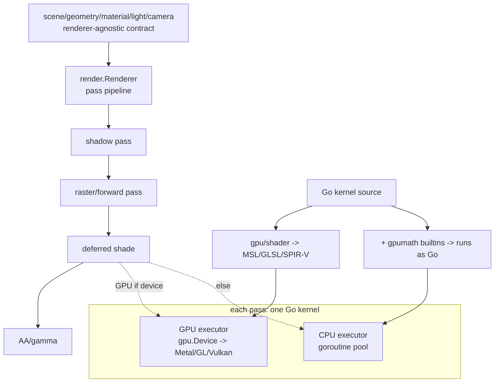

# Unified CPU/GPU renderer

## Overview

polyred has grown two rendering paths that do not share an abstraction: a mature
CPU rasterizer (`render/` + `shader/`) and a GPU stack (`gpu/` + `gpu/shader/`)
that today only offloads two passes (deferred shading, gamma). The goal is one
renderer abstraction where **work is authored once and runs on the GPU by
default, falling back to the CPU when no GPU device is available** (or when a
pass has no GPU implementation yet). This is the foundation for growing polyred
from a rasterizer into a small engine (scene management, rasterization, and later
ray tracing), without forking CPU and GPU code.

The cross-backend parity harness (`gpu/parity_*_test.go`) already proves Metal,
GL, and Vulkan agree with a CPU oracle bit-for-bit on shading kernels; that same
mechanism becomes the correctness guarantee for CPU↔GPU unification.

## Current State

Research summary (see also `docs/gpu-abstraction.md`):

- **Renderer-agnostic frontend (the contract).** `scene/` (graph + `IterObjects`/
  `Lights`), `geometry/`, `geometry/mesh`, `geometry/primitive`, `material/`,
  `light/`, `camera/`, `math/`, `color/`, `buffer/` describe *what* to render and
  import neither `render` nor `gpu`. A `Scene` already feeds either path.
- **CPU renderer.** `render/` rasterizes on the CPU: `passShadow` → `passForward`
  → `passDeferred` → `passAntialiasing`, shading via `shader/`'s `FragmentShader`
  (Blinn-Phong) into a concurrent `buffer.FragmentBuffer`.
- **GPU offload, per-pass, with fallback.** `render/raster.go` already tries the
  GPU for two passes and silently falls back to CPU on any error:
  `passDeferred` → `gpuDeferredShade` (`render/gpudeferred.go`), `passAntialiasing`
  → `gpuGammaCorrect` (`render/gpugamma.go`). Enabled by the `render.GPU(dev)`
  option. Forward rasterization and shadows are CPU-only today.
- **Two shader stories, not yet unified.** `shader/` runs Blinn-Phong on the CPU
  (`primitive.Vertex`→`primitive.Fragment`→`color.RGBA`). `gpu/shader/` is the
  Go→shader compiler (`Compile`→MSL, `CompileGLSL`→GLSL, +glslang→SPIR-V). The GPU
  deferred kernel is authored in Go and lives in `render/gpudeferred.go`; the CPU
  Blinn-Phong is a *separate* hand-written implementation in `shader/`.
- **Backends.** `gpu/` is a WebGPU-style `Device` API with Metal (darwin), GL and
  Vulkan (Linux, CI-verified on Mesa) backends, and a DX12 probe. cgo-free.
- **No ray tracing / acceleration structures** anywhere yet.
- **Apps.** `cmd/` has 5 (simple, gpudemo, polyred, polywine, polyterm). The
  sibling `../cmd` is a stale 2022 duplicate (deprecated `poly.red/x/app`); all
  its apps exist in `cmd/`. Safe to retire.

## Architecture

The unification happens at **two seams**, both already half-present:

1. **Author work once as Go kernels.** A pass's per-fragment / per-element logic
   is a Go function over buffers (exactly the `render/gpudeferred.go` shape). The
   *same source* (a) compiles to MSL/GLSL/SPIR-V via `gpu/shader` for the GPU, and
   (b) runs directly on the CPU as plain Go, because the kernel is plain Go using
   a small builtin library (`normalize`, `dot`, `pow`, …). Provide those builtins
   as a Go package (`gpu/shader/gpumath` or similar) so the identical kernel file
   imports them and runs on CPU, while the compiler maps them to shader builtins
   for the GPU. One source, two execution targets — and the parity harness proves
   they match.

2. **A pass runs on GPU-if-available, else CPU.** Generalize the existing
   per-pass fallback (`passDeferred`, `passAntialiasing`) into a uniform `Pass`
   concept: a kernel + its bindings + a dispatch size, with a GPU executor (the
   `Device` API) and a CPU executor (run the Go kernel over a goroutine pool, the
   existing `DrawFragments`/`sched` machinery). The renderer is a pipeline of
   passes; each chooses its executor from device availability.

**GPU by default, CPU fallback.** `render.NewRenderer(...)` opens a `gpu.Device`
(`gpu.Open()`) automatically; success ⇒ passes prefer GPU; failure (or a pass
with no GPU kernel yet) ⇒ CPU. `render.CPU()` / `render.GPU(dev)` options force a
path for tests/benchmarks. This flips today's default (CPU, opt-in GPU) to
(GPU, automatic fallback) without changing the public `Render()` surface.

## Components

### `render` — the unified renderer (orchestrator)

- Keep the public `Renderer`/`NewRenderer`/`Option`/`Render()` surface.
- Replace the hardcoded pass sequence with a `[]Pass` pipeline. Each `Pass`
  carries: the Go kernel (or a CPU func + GPU `ShaderModule`), its input/output
  buffer bindings (derived from the scene G-buffer), and a dispatch size.
- A `passRunner` picks GPU (encode + submit via `gpu.Device`) or CPU (run the Go
  kernel over `internal/sched`), mirroring `render/raster.go`'s current
  try-GPU-then-CPU but generalized to every pass.
- Device acquisition: `NewRenderer` calls `gpu.Open()` unless `render.CPU()` is
  set; stores `*gpu.Device` (nil ⇒ all-CPU).

### `gpu/shader` + `gpumath` — author-once kernels

- `gpu/shader` (the compiler) is unchanged.
- Add `gpumath`: Go implementations of the kernel builtins (`normalize`, `length`,
  `dot`, `cross`, `reflect`, `clamp`, `mix`, `pow`, trig, `Vec2/3/4`, `Mat4`,
  swizzles via methods). A kernel file imports `gpumath` and is ordinary Go that
  runs on the CPU; the compiler recognizes the same names and emits shader
  builtins. The `render/gpudeferred.go` deferred/shadow kernels become the first
  author-once kernels, replacing the separate `shader/` Blinn-Phong.
- Migration is incremental: one pass at a time moves from "CPU code in `shader/`
  + separate GPU kernel" to "one kernel run both ways", guarded by parity tests.

### `scene` and the frontend — mostly unchanged

Already renderer-agnostic. Minor work: ensure the G-buffer attributes a pass
needs (normals, world position, base colour, material indices, light/material
tables) are produced by the raster pass in a backend-neutral `buffer` layout that
both executors consume. This is the "scene → buffers" contract.

### Ray tracing (future renderer mode)

A second renderer mode alongside rasterization, built on the same seams:
- A BVH over scene triangles (`geometry/bvh` or `accel/`), built CPU-side.
- A ray-trace/closest-hit kernel authored in Go (rays × BVH × materials), run on
  GPU compute (the proven compute path) or CPU. Same author-once + GPU/CPU-pick
  design; no new backend work.
- Out of scope for the first phases; the abstraction must not preclude it (passes
  and kernels generalize to compute over rays, not just fragments).

### `cmd` apps

The apps consume `render` + the frontend; the unified default means they get GPU
acceleration for free (with CPU fallback) without code changes. `gpudemo` stays
the low-level `gpu` showcase. Retire `../cmd` (stale duplicate; the user's call,
like `../gpu`).

## Package Organization (before → after)

Minimal-disruption reorg; the renderer-agnostic frontend keeps its layout.

| Concern | Today | After |
| --- | --- | --- |
| Scene contract | scene, geometry, material, light, camera, math, color, buffer | unchanged |
| Low-level GPU | gpu, gpu/{mtl,gl,vk,ctx}, gpu/shader | unchanged |
| Kernel builtins (CPU exec) | — | new `gpumath` (or `gpu/shader/gpumath`) |
| Shading kernels | split: `shader/` (CPU) + `render/gpudeferred.go` (GPU) | converge to author-once kernels (a `kernels/` set) |
| Renderer | `render/` (CPU + ad-hoc GPU offload) | `render/` = pass pipeline + GPU-default/CPU-fallback runner |
| Apps | cmd (5), ../cmd (stale) | cmd; ../cmd retired |
| Ray tracing | — | `accel/` (BVH) + ray kernels, later |

## Data Flow

`Render()` → build/refresh the G-buffer from the scene (raster pass) → run the
pass pipeline (shadow, shade, AA…), each pass dispatched on GPU or CPU from the
same Go kernel → read back the final image. The GPU path keeps everything in
device buffers across passes where possible (avoid per-pass readback); the CPU
path uses `buffer.FragmentBuffer`. Both end at an `*image.RGBA`.

## Error Handling / Fallback

Per-pass: attempt GPU, and on *any* error (device lost, unsupported feature,
compile failure) log and fall back to that pass's CPU executor — the existing
`passDeferred` behaviour, made uniform. A renderer with no device runs all-CPU.
Fallbacks must be observable in tests (today's `gpuDeferredUsed` flag generalized
to a per-pass record) so CI can assert which path ran.

## Testing Strategy

- **CPU↔GPU parity is the core guarantee.** Extend the existing parity harness
  (`gpu/parity_*_test.go`) so every author-once kernel is checked: GPU result vs
  the *same kernel run as Go on the CPU* vs a reference. This makes "the CPU and
  GPU renderer agree" a CI invariant, across Metal/GL/Vulkan.
- **Golden-image tests** for whole frames (small scenes) compared within
  tolerance across CPU and GPU paths, per platform.
- **Fallback tests**: force `render.CPU()` and confirm identical output; force a
  pass's GPU path off and confirm the CPU executor matches.
- Reuse the per-backend CI jobs (macOS/Metal, gl-probe/Mesa, vk-probe/lavapipe).

## Migration Path (phased, CI-green throughout)

1. **`gpumath` + author-once deferred kernel.** Provide the builtin library; make
   `render/gpudeferred.go`'s deferred kernel run on the CPU as Go too; assert
   CPU-as-Go == GPU == current CPU `shader/` Blinn-Phong via parity. (Proves the
   author-once mechanism on a real pass.)
2. **`Pass` abstraction + runner.** Refactor `passDeferred`/`passAntialiasing`
   into the uniform pass/runner; behaviour-preserving. Generalize `gpuDeferredUsed`
   to a per-pass path record.
3. **GPU-by-default.** `NewRenderer` auto-opens a device; add `render.CPU()`.
   Existing tests pin paths explicitly; default flips to GPU+fallback.
4. **Grow GPU coverage pass by pass.** Shadow pass kernel (already have
   `shadowKernel`), then AO, then forward/raster on GPU — each author-once, each
   parity-gated.
5. **Frontend tidy + retire `../cmd`.**
6. **Ray tracing mode** (`accel/` BVH + ray kernels) once the pass/kernel
   abstraction is settled.

Each phase is independently shippable and keeps the CPU renderer, the three GPU
backends, and the parity suite green.

## Risks

- **CPU-as-Go kernel performance.** Running shader kernels as interpreted-ish Go
  per fragment may be slower than the hand-tuned `shader/` path. Mitigation: the
  CPU executor batches over the goroutine pool; author-once is about *correctness
  and single-source*, with the GPU path carrying the performance. Keep a
  hand-optimized CPU path option where it matters.
- **std140/MSL uniform layout drift** across CPU/GPU — already handled for the
  storage-buffer parity kernels; uniforms need the documented 16-byte rules.
- **Scope.** This is xlarge; the phased path keeps each step small and verified.
  Break this spec down (`/wf-spec-breakdown`) before implementing.
